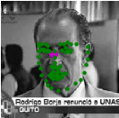
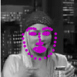
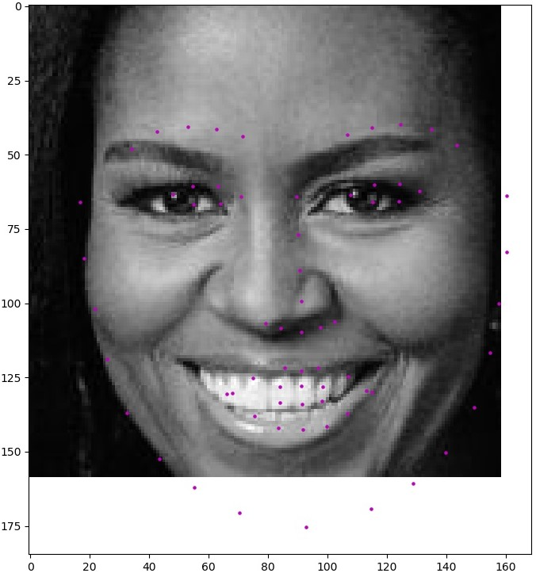

# Facial-Keypoints-Detection
**Tools and Technology used:** Python, PyTorch, Matplotlib, openCV

Facial keypoints (also called facial landmarks) are the small magenta dots shown on each of the faces in the image above. In each training and test image, there is a single face and 68 keypoints, with coordinates (x, y), for that face. These keypoints mark important areas of the face: the eyes, corners of the mouth, the nose, etc. These keypoints are relevant for a variety of tasks, such as face filters, emotion recognition, pose recognition, and so on. Here they are, numbered, and you can see that specific ranges of points match different portions of the face.

In this project we are defining and training a convolutional neural network to perform facial keypoint detection, and use computer vision techniques to transform images for training and testing.

## How to run the code:
    1. To train and test the model:
       python main.py 
    2. To use the trained model on any random image:
       python fkp.py
    3. To use filters:
       python filters.py

## Results
1. facial key point detection before training (PINK = detected keypoints, GREEN = ground truth):

    

2. facial key point detection after training:

      

3. Facial keypoint detection on a random image:

      

4. Applying filters on an image

      
