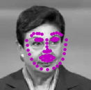

# Facial-Keypoints-Detection
used implemented a CNN based facial keypoint detection

**Tools and Technology used:** Python, PyTorch, Matplotlib, openCV

## How to run the code:
    1. To train and test the model:
       python main.py 
    2. To use the trained model on any random image:
       python fkp.py
    3. To use filters:
       python filters.py

## Results
1. facial key point detection before training (PINK = detected keypoints, GREEN = ground truth):

      

2. facial key point detection after training:

      

3. Facial keypoint detection on a random image:

